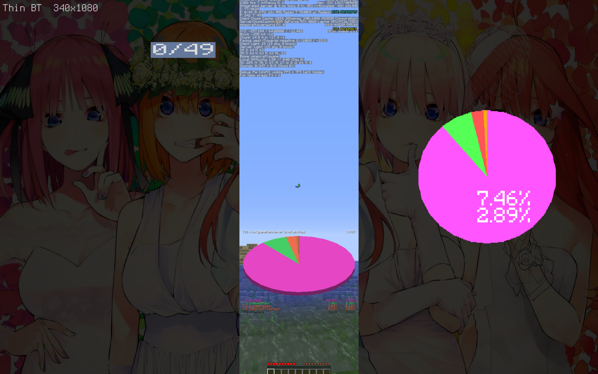
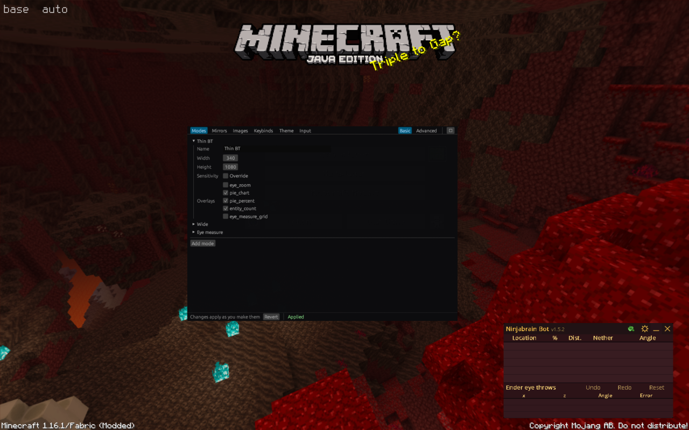
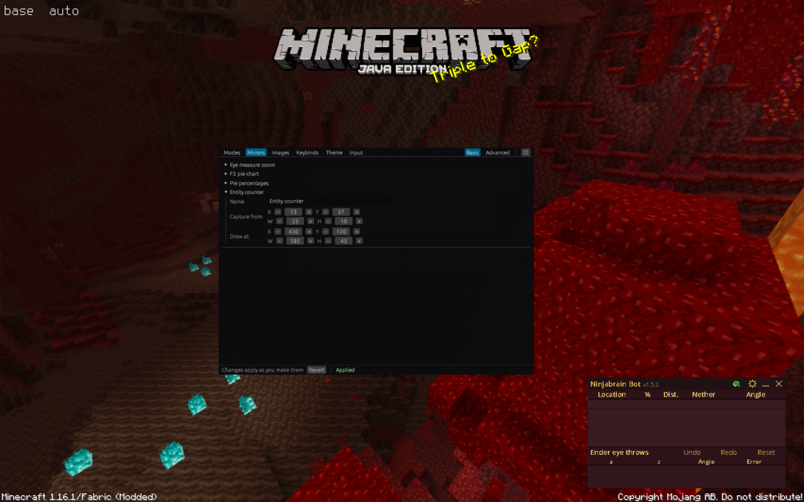
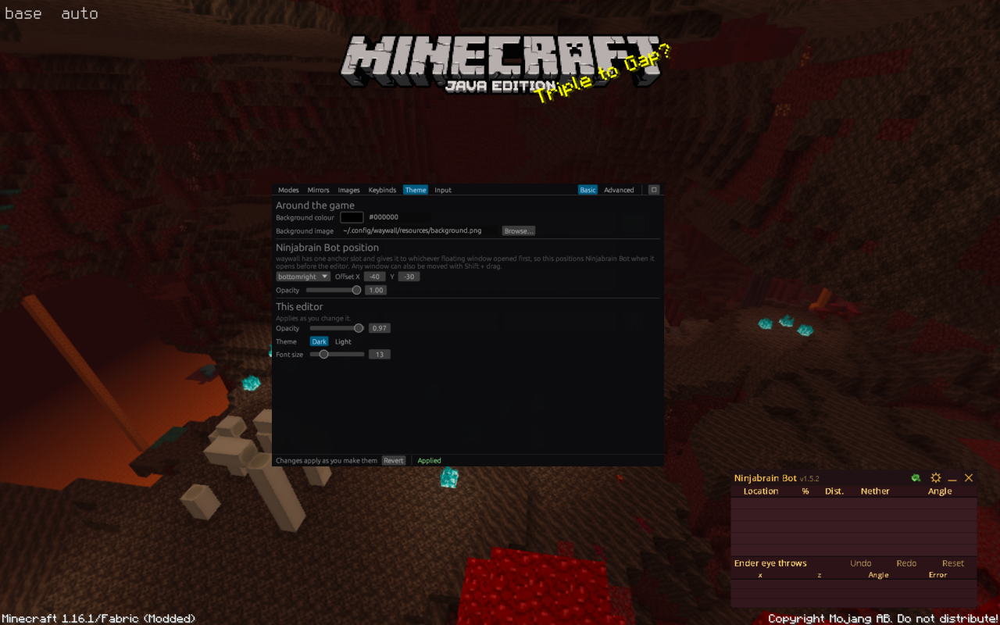

# toolwall

A GUI and configuration layer for [waywall](https://github.com/tesselslate/waywall),
the Wayland compositor for Minecraft speedrunning on Linux.

> Inspired by [Toolscreen](https://github.com/jojoe77777/Toolscreen), which is
> Windows only. There was no equivalent on Linux, so this is an attempt at one.
> Plenty more is planned over the coming days.
>
> I used Claude to help debug this and to write the code comments.

waywall is configured by hand-writing Lua. toolwall turns that configuration
into data, a single JSON file, and gives you a CLI and an in-game editor to
change it, with edits applying live.

## Why not fork waywall

toolwall is not a patched waywall, on purpose:

- It installs alongside any waywall version and survives waywall updates.
- You can use the runtime library without the GUI, or the GUI without the
  presets.
- It stays separately licensable (see [Licence](#licence)).

The whole integration relies on two facts about waywall:

1. Its Lua config can be a small shim that reads a data file.
2. It hot-reloads on any `.lua` change in its config directory.

That is enough to apply config edits live with no changes to waywall's C
source.

There is one exception, and it is opt-in. `patches/` holds small additions to
waywall itself, all of them for the Ninjabrain Bot readout: a filled rectangle,
an outline on scene text, and a way to keep ninb's own window hidden. None can
be done from Lua, because waywall has no fill primitive, no outline parameter,
and one visibility flag shared by every floating window. toolwall checks for
them at runtime and does without if they are missing, so an unpatched waywall
still works. See [Patching waywall](#patching-waywall).

## How it works

```
  toolwall-gui  ─┐
                 ├─→  toolwall.json  ─→  toolwall.lua runtime  ─→  waywall
  toolwall CLI  ─┘         ▲                    (scene objects,
                           │                     modes, keybinds)
                  toolwall_reload.lua
                  (bumped to trip the watcher)
```

The GUI and CLI never talk to waywall. They write JSON, then bump a counter in
`toolwall_reload.lua`. waywall's file watcher sees the `.lua` change, rebuilds
its Lua VM, and the runtime re-reads the JSON.

That trigger file is doing real work. waywall watches `.lua` files only, so it
will never notice a change to `toolwall.json` by itself.

## Screenshots

### Thin BT with the overlays live



Thin BT mode at 340x1080. The game is the narrow strip down the middle; the
rest of the screen is background image. Everything else here is drawn by
toolwall:

- **Top left**: the HUD text, showing the active mode and its resolution.
- **`0/49`**: the entity counter, a mirror of the `E:` line from F3, captured
  at 37x9 game pixels and drawn 5x larger so it is readable at a glance while
  eraying a bastion.
- **Right**: the F3 pie chart, mirrored out of the bottom-right corner of the
  game and magnified. It is drawn as one layer per pie colour, because colour
  keying passes only the colour it matches, which is what lifts the chart off
  the world behind it.
- **`7.46%` / `2.89%`**: the pie percentages as their own overlay, captured
  from a 33x25 region and drawn at 6x.

Captures are anchored to a corner rather than pinned to absolute coordinates,
so the same overlay stays correct when the resolution changes.

### The editor: Modes



`Ctrl+I` opens the editor over the game. Modes set a resolution, an optional
sensitivity override, and which overlays come up automatically. Basic hides the
ids and layering; Advanced shows everything.

Note the status bar: there is no save button. Edits apply about a third of a
second after you stop making them, and the mode you are in survives the reload.

### The editor: Mirrors



Every rectangle has -/+ steppers, because placing an overlay is nudging rather
than typing. Changes apply live, so the overlay moves on screen while you
adjust it.

### The editor: Theme



Background colour picks from a swatch, background image has a file browser.
Ninjabrain Bot is open on the right, launched by toolwall and positioned by the
anchor settings shown here.

The editor styles itself from the same config: opacity over the game, dark or
light, and font size, all applied as you drag them.

## Install

You need a working waywall setup, a Rust toolchain, and `luajit` if you want to
run the runtime tests.

```sh
git clone https://github.com/fushijo/toolwall
cd toolwall

./install.sh                              # runtime + overlays into ~/.config/waywall
cargo install --path crates/toolwall-cli  # the `toolwall` command
cargo install --path crates/toolwall-gui  # the in-game editor

toolwall validate
```

`install.sh` copies the Lua runtime and the measuring overlay into your waywall
config directory, backs up your existing `init.lua` as `init.lua.pre-toolwall`,
and replaces it with two lines:

```lua
local toolwall = require("toolwall")
return toolwall.setup()
```

waywall adds its config directory to `package.path`, which is what makes
`require("toolwall")` resolve.

### Patching waywall

Optional. Only the Ninjabrain Bot readout uses it.

```sh
patches/apply.sh ~/waywall
```

That applies the patches to your waywall checkout, rebuilds it, and asks for
your password once to install. If you do not have a checkout, clone one first:

```sh
git clone https://github.com/tesselslate/waywall ~/waywall
```

The patches add three things:

| | what it does | why it cannot be done in Lua |
|---|---|---|
| `waywall.rect` | fills an area with a solid colour | `image` draws a PNG as-is, and colour keys are mirror-only upstream, so there is no way to fill anything |
| `outline` on `waywall.text` | draws each glyph eight times behind itself | `text` takes x, y, colour, size and depth, and nothing else |
| `theme.ninb_hidden` | keeps the anchored window hidden | `show_floating` is one flag for every floating window, so revealing the editor reveals Ninjabrain Bot too |

Building waywall from scratch needs meson 1.4 or newer, since it is C23. An
existing `build/` directory is reused.

All three are additive. A config that does not ask for them behaves exactly as
it did before. Written against waywall `150026e`; `git apply` refuses rather
than making a mess if the code has moved. Full detail in
[`patches/README.md`](patches/README.md).

Skip this and the readout still works, just flat on the game with no panel
behind it, and ninb's own window still appears whenever the editor does.

## Ninjabrain Bot readout

ninb's window is a floating window, and `show_floating` is global, so it
appears and disappears with the editor. The Ninjabrain tab draws the same
readout into the scene instead, where nothing else can hide it. Two presets:
the labelled Ninjabrain Bot layout with a panel, or Compact, which is one
templated line per prediction.

It reads ninb's HTTP API, which is off by default and has to be turned on in
ninb's own settings. With **Live** on it holds ninb's event stream open, so a
change shows up as ninb makes it rather than on the next poll. That is the
difference you feel when spamming F3+C to line up a throw.

waywall's Lua has no sockets and `exec()` returns no handle, so the stream is
held by a generated shell script: `curl` streams, the loop keeps only the
newest event, and it lands in a cache file by rename. The file never grows and
Lua only ever reads it. `flock` is the single-instance guard, which also makes
"start it again" the way to recover after ninb restarts. If the stream cannot
start at all, it falls back to one-shot fetches and says so in the log.

Set **Enabled** and it starts with waywall, which is what you want alongside
`theme.ninb_hidden`. Otherwise bind `ninb.overlay` to a key.

### Its hotkeys

ninb's own hotkeys, the ones that nudge the last angle and undo a throw, are
not toolwall keybinds and cannot be. ninb watches the keyboard itself rather
than being sent keys, so they live in its settings, which is exactly what
hiding its window takes away.

The Ninjabrain tab edits them directly, in `~/.java/.userPrefs/ninjabrainbot/
prefs.xml`. Saving restarts ninb, because it rewrites that file when it exits
and would otherwise undo the change.

**A hotkey your desktop has claimed never arrives.** Print Screen and anything
with Super are the usual ones: the outer compositor answers them and waywall
never sees the key, so neither does ninb. The tab marks those. Function keys
and Page Up / Page Down are safe choices.

Modifiers are saved as the left-hand key, because ninb stores a side and
requires that exact side to be held. A hotkey saved here fires on left Ctrl,
not right.

### Two things that will otherwise waste your time

**`gui.command` needs a full path.** waywall `exec()`s it using the
compositor's own `PATH`, which comes from however waywall was launched, so it
usually does not include `~/.cargo/bin` the way an interactive shell does. A
bare `toolwall-gui` fails silently, leaving only an `execvp` line in waywall's
log. The shipped config uses `~/.cargo/bin/toolwall-gui`.

**Overlay coordinates are waywall window pixels, not your monitor.** waywall
reports its window size to the instance, which you can read from `Display:` in
F3. On a 1920x1200 panel at 125% scaling that is 1707x1067. An overlay
positioned past that edge just does not draw, with no warning and no error.

## Use

```sh
toolwall validate                                  # check without applying
toolwall modes                                     # list modes
toolwall get modes.thin.resolution.width
toolwall set modes.thin.resolution.width 340       # applies live
toolwall reload                                    # re-trigger without editing
```

Dotted paths index arrays by their `id`, so `modes.thin` works and survives
reordering.

In game, `Ctrl+I` opens the editor as a floating window. Edits apply about a
third of a second after you stop making them, so there is no save button. The
mode you are in survives the reload, which means you can nudge a rectangle and
watch it move. `Esc` closes the editor.

Minecraft has to release the cursor before you can click a floating window.
Opening the editor presses Escape into the game to make that happen.

## Measuring window

The boat-eye measuring view is a mirror magnifying a slice of the game, with
the numbered grid drawn on the same rectangle, so its centre line lands on the
crosshair. Two numbers decide whether it measures anything real:

- The capture has to be **60 game pixels wide**. The grid is 18 bands, and
  60/18 makes one band exactly one game pixel.
- The destination width has to be a **multiple of 60**. Otherwise a band covers
  a fractional number of screen pixels and the error adds up across the scale.
  960, 720 and 600 are exact. 980 is not, and drifts about two pixels end to
  end.

The capture is anchored `center`, so it follows the crosshair as the resolution
changes instead of needing to be repositioned for each mode.

## Config model

| Concept | What it is |
| --- | --- |
| **mode** | A resolution, an optional sensitivity, and the overlays live while it is selected. Thin BT, wide, eye measure. |
| **mirror** | A region of the Minecraft window drawn elsewhere, with optional colour keying and shader. |
| **image** | A PNG overlay. |
| **text** | A HUD element with `{mode}`, `{res}`, `{sens}`, `{state}` placeholders. |
| **keybind** | An input string bound to a command from a fixed set. |

Captures can be anchored to a corner or to the centre, so one rectangle stays
correct at every resolution. Minecraft pins its debug HUD to the corners at
fixed pixel offsets, which is why a capture written in absolute coordinates
only works at the resolution it was written for.

A mirror can carry several colour keys, drawn as one layer each. Colour keying
passes only the matching colour, so pulling something many-coloured like the
pie chart out of the world behind it means stacking one layer per colour. A
crop shader does the same job in one pass and looks better, but waywall
compiles shaders at startup only, so shaders cannot be edited live.

Keybinds name commands and never contain Lua source, so a config downloaded
from someone else cannot run arbitrary code when it loads. `exec` exists but is
off unless `gui.allow_exec` is set.

`schema/toolwall.schema.json` is the contract. Point your editor at it for
completion and inline validation.

## Testing

```sh
luajit tests/run.lua        # runtime, against a mock waywall
cargo test --workspace      # schema, validation, and headless GUI layout
```

`tests/mock/waywall.lua` stands in for the real module and enforces the
lifecycle rules that are painful to debug live: most API calls are illegal
during startup, a closed scene object cannot be reused, and `set_resolution`
fails until the Minecraft window exists.

The GUI tabs are covered by headless egui layout passes, so no compositor or
GPU is needed. You can develop the whole thing without launching Minecraft.

## Status

Working: modes, mirrors, images, keybinds, input, the measuring window, pie
chart and entity counter overlays, Ninjabrain Bot launching, and the in-game
editor with live apply.

Planned:

- More of Toolscreen's feature set.
- A visual rectangle editor, so overlays can be dragged instead of typed.
- HUD text polish and per-mode text.
- Upstream waywall work: per-window floating control and general anchoring.

## Known limitations

These come from waywall, not from toolwall:

- **`show_floating` is global.** Opening the editor also reveals Ninjabrain
  Bot. Fixing it properly needs an upstream patch for per-window control.
- **There is one anchor slot**, and it goes to whichever floating window opened
  first. Other floating windows can only be shift-dragged.
- **No mouse position in Lua.** waywall exposes key and button actions and
  `get_key()` polling, but no cursor coordinates. That is why the editor is a
  floating window rather than drawn with scene objects.
- **Scene objects have no visibility flag.** Hiding means closing and
  recreating. Negative depth is not a substitute, since it draws behind
  Minecraft, which only hides things while Minecraft covers that region.
- **Shaders compile at startup only**, so they cannot be edited live.
- **Scene text has one font and one colour.** The face is the bundled Terminus
  at 8x16, scaled by a whole number, with no way to pick another. toolwall
  works with the grid rather than against it: a column is a character count,
  which is what lets the Ninjabrain readout line up its labels and values.
  Multiple colours on one line means multiple text objects.
- **No fill primitive and no text outline** without the patches in `patches/`.
- **`show_floating` has no per-window form.** `theme.ninb_hidden` in `patches/`
  is the narrow fix: it keeps only the anchored window hidden.
- **Ninjabrain Bot calibration does not work correctly inside waywall.** Use
  boat eye, or calibrate outside.

## Licence

MIT.

toolwall is a separate program that talks to waywall through configuration
files. It does not link against or derive from waywall's source, so waywall's
GPL-3.0-only licence does not extend to it.

`patches/` is the exception. Those are diffs against waywall's C source, so
they are derived from it and are GPL-3.0-only. They are not compiled into or
linked against anything here: they are applied to your own waywall checkout,
which you then build yourself. Nothing under `patches/` ships in the toolwall
binaries.

## Credits

- [waywall](https://github.com/tesselslate/waywall) by tesselslate, the
  compositor this is built on.
- [Toolscreen](https://github.com/jojoe77777/Toolscreen) by jojoe77777, the
  Windows tool this is modelled on. No shared code, and toolwall is not
  affiliated with or endorsed by it.
- [Linux MCSR Resources](https://linux-mcsr-resources.github.io/), the
  community index.
- [waywall_generic_config](https://github.com/arjuncgore/waywall_generic_config)
  by gore. The capture geometry for the pie chart and entity counter, and the
  god-sens multipliers, are taken from that config.
- [Pixel-Perfect Tools](https://priffin.github.io/Pixel-Perfect-Tools/overlayGen.html)
  by priffin, for generating measuring overlays.
