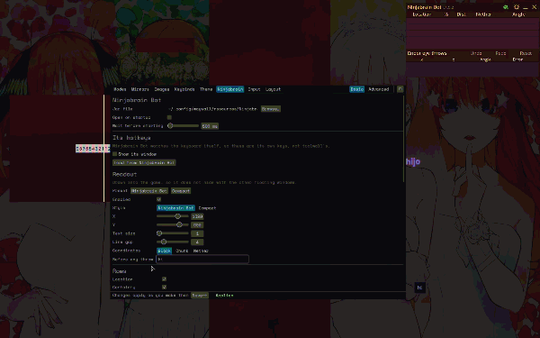
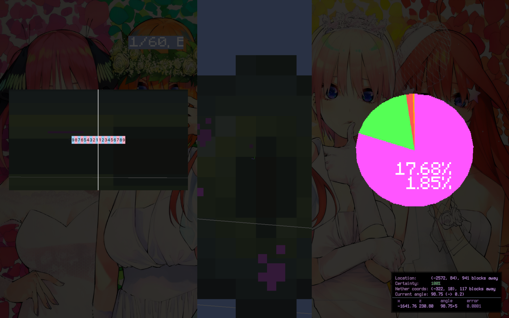
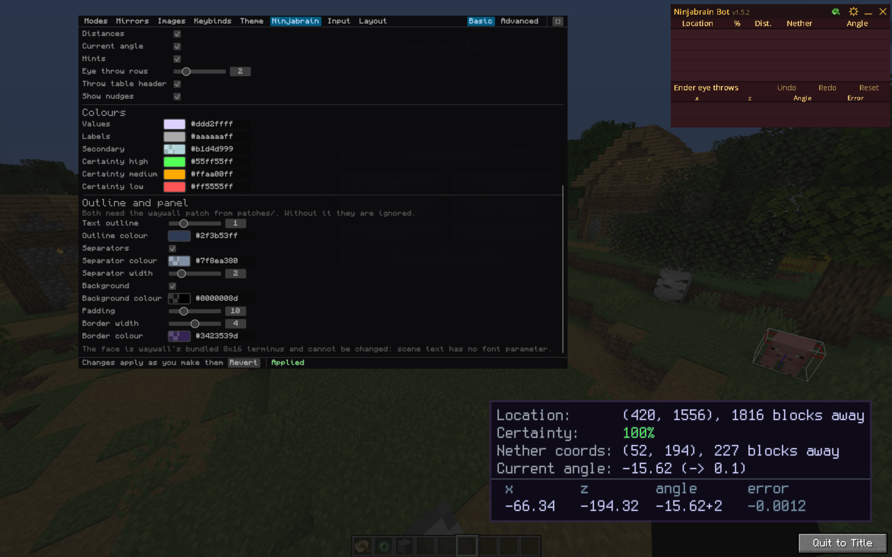
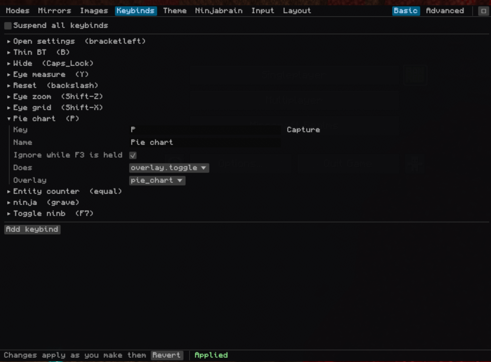
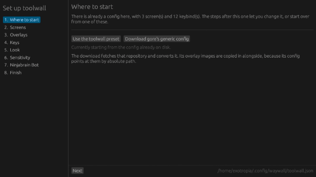

# toolwall


A GUI and configuration layer for [waywall](https://github.com/tesselslate/waywall),
the Wayland compositor for Minecraft speedrunning on Linux. Also contains a setup installer 
that makes it easy for people to configure their own overlays, keybinds and boateye.

> In development, please DM me on Discord 'exotropian' for help/issues. I'll be happy to help! 
> Inspired by [Toolscreen](https://github.com/jojoe77777/Toolscreen), which is
> Windows only. There was no equivalent on Linux, so this is an attempt at one.
> Plenty more is planned over the coming days.
> I used Claude to help debug this and to write the code comments (pls forgiv)

waywall is configured by hand-writing Lua. toolwall turns that configuration
into data, a single JSON file, and gives you a CLI and an in-game editor to
change it, with edits applying live.

## The problem

Hand-writing Lua is fine until you want to move an overlay four pixels left.
Then you are editing lua and trying to get it perfect.

Setting up and installing configs/editors is a hassle, so we have an installer!

Windows runners have Toolscreen for this. I dont think there is one for Linux

## What you get

- **A config file instead of a program.** One JSON document, so a GUI can edit
  it safely and you can share it without shipping someone executable Lua.
- **An editor you open in game.** `Ctrl+I`, which works rly well just like toolscreen.
- **Your existing config comes with you.** The install reads generic configs and converts it into toolwall friendly.
- **A CLI**, for scripting or when you would rather type (not recommended for general use cases)

## Screenshots

### Overlays in play



Measuring window, entity counter, pie chart and the Ninjabrain readout, all
drawn by toolwall.

### Ninjabrain readout



The readout is scene text, not a window, this would need the waywall patch to run correctly.

### Keybinds



Every key, what it does, and whether F3 should suppress it.

### Modes


Resolution, optional sensitivity override, and which overlays come up with it.

### Mirrors


Rectangles have -/+ steppers, because placing an overlay is nudging rather than
typing.

### Theme


The editor styles itself from the same config: opacity, dark or light, font.

## Just tell me what to do

You have waywall working and you want this running. Five minutes.

0. Make sure your instance actually runs under waywall first. In Prism:
   *Edit Instance* then *Settings* then *Custom commands*, and put
   `waywall wrap --` in the **Wrapper command** box. If Minecraft already
   opens inside waywall, you have done this.
1. Grab the tarball from [releases](https://github.com/fushijo/toolwall/releases/latest),
   unpack it, and run `./install.sh`. Say yes to both questions. The first
   build takes a few minutes.
2. The setup window opens. On **Where to start**, hit *Use the toolwall
   preset*. (If you already have a waywall config, it has been converted
   already and you can leave this alone.)
3. **Screens** and **Overlays**: leave them as they are your first time
   through. You can change any of it later from inside the game.
4. **Keys**: the top one opens the editor. `Ctrl-I` unless you want something
   else.
5. **Sensitivity**: click your instance, hit *Calculate*, hit *Use these*.
   Then put the Minecraft number it shows you into the game's own settings,
   because that is the one it cannot set for you.
6. **Ninjabrain Bot**: point it at your jar, or leave it empty. Ignore the
   orange box for now.
7. **Finish**: *Write the config*.

Launch your instance and press `Ctrl-I`. That is it.

If it goes wrong, `./uninstall.sh` puts your old config back.

## Install

You need waywall working already, plus a Rust toolchain. `luajit` too if you
want to run the tests.

You should just use the tarball in the releases.

`install.sh` offers to build the editor and then opens a setup window, which
is where you actually decide what your config is. After that, launch your
instance and press `Ctrl+I`.

To do it by hand instead: (not recommended for beginners)

```sh
cargo install --path crates/toolwall-cli
cargo install --path crates/toolwall-gui
toolwall-gui --setup
```

`install.sh` also drops a **toolwall setup** entry into your app menu, so you
can come back to it without a terminal.

### The setup window



Eight steps down the side, nothing written until the last one.

- **Where to start.** Keep the config the install just converted, start from
  the toolwall preset, or download [gore's generic config][gore] and convert
  that. It also lists everything an import could not carry across, so you can
  put those parts back yourself in the steps that follow.
- **Screens, Overlays, Keys.** Which resolutions you want, which overlays,
  and what opens each. Overlays are on a key, on the whole time, or not there.
- **Look.** Background and the editor's font.
- **Sensitivity.** gore's [boat eye calculator][calc] built in. It reads your
  Minecraft sensitivity out of `options.txt` if it can find your instances,
  works out the waywall multipliers, and writes them into the config, with the
  tall coefficient going on the tall screens. Worked out at 30 FOV, since that
  is where you put it to measure and then put it back. The one number it
  cannot set for you is Minecraft's own.
- **Ninjabrain Bot.** The jar, and a plain warning about the waywall patch the
  in-game readout needs, which you should not touch on a first setup.

[calc]: https://arjuncgore.github.io/waywall-boat-eye-calc/

If `toolwall` comes back as "command not found", cargo put it in
`~/.cargo/bin` and your shell is not looking there, run:

```sh
echo 'PATH="$HOME/.cargo/bin:$PATH"' >> ~/.bashrc
```

### It reads the config you already have

If you already run waywall, the install converts your config instead of
replacing it. Resolutions, mirrors, overlays, rebinds, and the keys you bound
them to all come across.

```
imported 3 mode(s), 5 mirror(s), 4 overlay image(s), 5 keybind(s)
  Thin       340x1080  (2 mirror(s), 1 image(s))
  Tall       384x16384  (3 mirror(s), 2 image(s))
  Wide       1920x300  (0 mirror(s), 1 image(s))
```

It works on [gore's generic config][gore], which is where most people start,
and on hand-written ones. A waywall config is technically a program, so it
cannot just be parsed: the importer runs it against a fake `waywall` module
that writes down what the config tried to build. Including all the keybinds in the
same sandbox and sorted by what they attempted, so a key reaching for
`set_resolution(340, 1080)` is your thin key whatever it was called.

Anything it cannot map is listed at the end and left out rather than guessed
at. That list also goes in `~/.config/waywall/toolwall-import-report.txt`, so
"what did it drop" is still answerable a week later when you finally reach for
the key that is missing.

Your config has no reason to bind a toolwall command, so the import adds one:
`Ctrl-I` opens the editor, or another key if yours was already using that. The
report says which.

`TOOLWALL_NO_IMPORT=1 ./install.sh` skips it.

### Taking it back out

```sh
./uninstall.sh
```

Puts your old `init.lua` back from the copy the install made, then removes the
runtime. Your `toolwall.json` is kept unless you pass `--all`.

If you no longer have that copy, or you want to land somewhere else:

```sh
./uninstall.sh --blank    # a blank waywall config
./uninstall.sh --gore     # download gore's generic config and use that
```

It never leaves you with a config that will not start. The two-line shim the
install writes needs the runtime, so deleting the runtime and leaving the shim
means waywall does not come up at all, which is why there is no option to do
nothing.

Everything toolwall ever puts on your disk, if you would rather do it by hand:

```
~/.config/waywall/init.lua                      replaced with a two-line shim
~/.config/waywall/init.lua.pre-toolwall         your original, copied once
~/.config/waywall/toolwall.lua
~/.config/waywall/toolwall/
~/.config/waywall/toolwall.json                 your config
~/.config/waywall/toolwall-import-report.txt
~/.config/waywall/resources/measuring_overlay.png
~/.cargo/bin/toolwall  ~/.cargo/bin/toolwall-gui
~/.local/share/applications/toolwall-setup.desktop
~/.local/share/toolwall/toolwall.png             the app menu icon
~/.local/state/toolwall.log
$XDG_RUNTIME_DIR/toolwall-*                     pidfiles, gone on reboot
```

[gore]: https://github.com/arjuncgore/waywall_generic_config

## When it goes wrong

Most of these are things someone actually hit, not things I imagined.

**Nothing happens when I press Ctrl+I.**
Three causes, in order of likelihood. Your instance is not running under
waywall, so check Prism's wrapper command. Or your config has no key bound to
`gui.toggle`, which is what `~/.config/waywall/toolwall-import-report.txt` will
tell you. Or `gui.command` points somewhere that does not exist, which you can
check with `toolwall get gui.command`.

**My overlays are in the wrong place, or off the side of the screen.**
toolwall has the wrong idea of how big waywall's window is. One command:

```sh
toolwall screen 2560 1440
```

That sets the size and moves every overlay to suit, anchoring them so it stays
right if the window changes again. The number you want is the **Display line in
F3**, not your monitor's resolution: on a scaled desktop those are different,
and the window is the smaller of the two.

**My mirrors did not come across when I imported my config.**
Fixed in 0.1.1. Configs that build overlays with `waywall.mirror` rather than
`helpers.res_mirror` used to import as nothing at all. Update, then
`./uninstall.sh --all` and `./install.sh`. The `--all` matters: without it your
existing `toolwall.json` is kept and the import is skipped again.

**I reinstalled and nothing changed.**
If `toolwall.json` already exists, the install keeps it and imports nothing. It
says so now. `./uninstall.sh --all` first.

**Typing in chat types the wrong thing.**
With the State Output mod, toolwall watches the key that opens chat and turns
your rebinds and custom layout off for that screen only, so a searchcraft
rebind still works in the recipe search. If chat is not on `T` for you, set
`input.chat_keys` to whatever it is. Without the mod, set a chat key in the
setup window, or bind `remaps.toggle` in the Keybinds tab, and press it again
to play.

**My resolution keys fire while I am typing in chat.**
Different problem: those are keybinds, not rebinds, so toolwall swallows the
key and Minecraft never sees it. Tick "Only while unpaused in a world" on them
in the Keybinds tab. The key then passes straight through to the game
anywhere else. Needs the State Output mod.

**A key I bound does nothing.**
waywall matches modifiers exactly, so `T` does not fire while Shift is held.
Use `*-T` if you want it to fire regardless. Names come from X11 keysyms, so it
is `Caps_Lock` and not `capslock`, and `bracketleft` and not `[`.

**My whole config stopped loading after I added a rebind.**
Rebinds are not keybinds. They use Linux keycode names, so `ESC` and not
`Escape`, `DOT` and not `period`. One wrong name aborts the entire config.
toolwall drops bad ones with a warning instead of letting that happen, but a
config hand-edited outside it can still do this.

**The game stops a few seconds into loading, with no crash report.**
Check the last line of the instance log. If it ends at
`Backend library: LWJGL version 3.2.2` and there is no crash report and no
`Stopping!`, the game did not crash, something took it down.

waywall keeps its own log at `~/.local/state/waywall/wrap-0`. If that also ends
abruptly, at a line like `new connection from process N`, then waywall itself
went down and the game went with it. That is a waywall crash, not a config
problem, and 0.3.3 stops toolwall doing anything during the window where it
happens: the Ninjabrain readout now waits for the game to exist before it
starts, instead of driving waywall's scene at 20Hz while Xwayland is still
coming up.

If it still happens on 0.3.3, that log plus the instance log is what to report,
and it is worth reporting to waywall rather than here.

**Ninjabrain Bot gets killed on launch, or the log says "X11 minecraft
detected".**
Fixed. toolwall waits for Minecraft's window before starting ninb. If ninb
opens first, waywall decides ninb is the game running under X11 and kills it.
Nothing is wrong with your GLFW path, whatever the banner says.

**The Ninjabrain readout does not draw in game.**
It needs a patched waywall. Stock waywall cannot fill a rectangle, so there is
nothing to draw the panel behind the text. See `patches/`. Do not do this on a
first setup.

**Ninjabrain Bot disappears a few seconds after F3+C.**
That is gore's and nml's configs, not this one. They hide it on a timer after
copying coords.

**My eye measurements are wrong.**
Check your FOV is at minimum (30) while measuring, and that `gui.screen`
matches your monitor. The sensitivity step assumes 30 because that is what you
measure at.

**Fullscreen looks blurry.**
Your configured resolution does not match your monitor. Launch without waywall
and read the resolution off F3, then set `gui.screen` to that.

**Where are the logs?**
`~/.local/state/toolwall.log`. waywall itself only writes to stderr, so if you
start your instance from a desktop entry that log is the only thing that
survives. Sending me that plus your `toolwall.json` is everything I need.

**I installed it and now I want my old config back.**
`./uninstall.sh`. Your original `init.lua` was copied to
`~/.config/waywall/init.lua.pre-toolwall` when you installed. If that copy is
gone, `./uninstall.sh --blank` or `./uninstall.sh --gore` will leave you with
something that starts.

**Opening the screen overlay killed my editor keybind.**
Fixed in 0.3.5. The editor and the screen overlay are the same binary,
`toolwall-gui` and `toolwall-gui --overlay`, and the guard that stops a second
copy starting matched on a substring. So each one saw the other's process and
decided it was already running, silently. If a stale copy is still hanging
around: `pkill -f toolwall-gui`.

**Changing a setting in game toggles fullscreen off, then on again.**
Fixed in 0.3.5. Every save reloads the config, and `fullscreen_on_start` was
running again each time. It is a toggle, so it flipped. It now happens once per
waywall rather than once per reload.

**The Ninjabrain readout ended up in the middle of the screen.**
Fixed in 0.3.5. `toolwall screen` moved every overlay to the new size but left
the readout where it was, so one that had been against the right edge at 1707
wide landed in the middle of 2560. Run `toolwall screen <w> <h>` again on
0.3.5, or just drag it in the Screen tab.

**How do I show a mirror in every mode?**
Tick *Show in every mode* on it in the Mirrors or Images tab. It is not a mode,
so it does not appear in the Modes tab. That puts it in `base_overlays`, which
is drawn whatever mode you are in, including none.

**The game looks soft or grainy at a distance.**
waywall does not implement Wayland's fractional scaling. On a desktop scaled to
125% or 150% it renders a buffer at the *logical* size and your compositor
stretches that to fill the panel, so the game really is drawing fewer pixels
than your monitor has. A 2560x1600 screen at 150% hands waywall a 1707x1067
window, and that is what Minecraft renders at.

You can fix this without touching your desktop scaling. waywall will render at
a size you choose while its window is fullscreen, which is what
`fullscreen_width` is for. Three settings, in this order:

```sh
toolwall screen 2560 1600
toolwall set window.fullscreen_width 2560
toolwall set window.fullscreen_height 1600
toolwall set window.fullscreen_on_start true
```

Use your panel's real resolution, not the scaled one. `screen` goes first
because toolwall refuses to write a config where the two disagree, and the
order matters: overlay coordinates are in render pixels, so they have to move
with it.

`fullscreen_on_start` is what makes it stick. The render size only applies
while fullscreen, so without it nothing changes until you remember a keybind.

The cost is real. In base mode you are asking for 2.25x the pixels, so watch
your frames on a reset. Thin and tall are unaffected, because there the game
renders at the mode's resolution either way. To undo it, set
`fullscreen_on_start` to false.

Setting your desktop to 100% scaling fixes it too, if you would rather have
that than the fullscreen requirement.

**Everything got slower.**
Try turning off `experimental.jit`. It is meant to help and sometimes does the
opposite.

**None of the above.**

```sh
toolwall validate
```

lists whatever is wrong with the config without applying it. If that comes back
clean and it is still broken, send me `~/.local/state/toolwall.log` and your
`toolwall.json` and I will have the actual reason instead of a guess.

## Using it

`Ctrl+I` opens the editor over the game. Edits apply about a third of a second
after you stop making them, so there is no save button, and the mode you are in
survives the reload. `Esc` closes it. This is all anyone using it casually needs.

From a terminal:

```sh
toolwall screen 2560 1440                      # window size, and move the overlays
toolwall validate                              # check without applying
toolwall modes                                 # list modes
toolwall get modes.thin.resolution.width
toolwall set modes.thin.resolution.width 340   # applies live
toolwall reload                                # re-trigger without editing
```

Dotted paths index arrays by `id`, so `modes.thin` keeps working when you
reorder things.

## Placing overlays

The Screen tab is a picture of waywall's window with every overlay on it. Drag
to move, corners to resize, and it snaps to edges, centres and the other
overlays with guides while you drag. Hold Alt to ignore the snapping.

Works for mirrors like the pie chart and entity counter, for overlay images
like the eye grid, and for the Ninjabrain readout. None of it needs the waywall
patch: positions and sizes are ordinary config fields. The patch only changes
how the readout's panel is drawn, not where it sits.

Bind a key to `screen.edit` and you get the same thing over the game itself:
a window the size of waywall's with nothing painted behind it, so you drag the
outline of a mirror across the actual mirror. Esc closes it. The tab is still
the better place to set things up before launching, or from a second monitor.

Set the screen size to match waywall's window before you start. Overlay
coordinates are window pixels rather than monitor pixels, and nothing reports
the size, so read it off the `Display:` line in F3.

## Keyboard layouts

The Layout tab is [xkbedit](https://xkbedit.github.io/) built into the editor,
so you can use it in game. Click a key, say what it should type.

Worth knowing: this is not the same as a rebind. A rebind changes *which key*
the game receives, always. A layout changes *which character* a key types, and
only where typing actually happens. So you can put an umlaut on `AltGr+Q` and
`Q` still drops items.

Still working on this so expect bugs.

## Ninjabrain Bot

toolwall can launch it, anchor it, and draw its readout into the scene as text
instead of a floating window. The readout needs ninb's API turned on (Settings
-> Advanced -> "Enable API", port 52533).

Its own hotkeys are global X11 grabs, so toolwall cannot bind them, but the
Ninjabrain tab edits them directly in ninb's preferences file.

## Measuring window

A mirror of the centre of the screen at tall resolution, with a grid overlay on
top, for measuring eye throws.

The capture has to be **60 game pixels wide** (18 grid bands, one band per game
pixel) and the destination width a **multiple of 60**, or the bands land on
fractional screen pixels and drift a couple of pixels end to end. 960, 720 and
600 are exact. 980 is not.

## Patching waywall

Optional, and only the Ninjabrain overlay uses it.

```sh
patches/apply.sh ~/waywall
```

Adds `waywall.rect` (a solid fill), an outline on scene text, and
`theme.ninb_hidden`. None of them can be done from Lua. toolwall checks for
them at runtime and does without if they are missing, so an unpatched waywall
is fine.

## Planned

- Per-mode HUD text, and more text placeholders.
- Presets you can drop in, for people who do not want to build a config.
- A wall/projector layout (dont think its possible unless waywall updates)
- Per-window floating control, upstream, so opening the editor stops also
  revealing ninb.

## Developing

```sh
luajit tests/run.lua      # the Lua runtime
cargo test --workspace    # everything else
```

To walk through a first run without touching the config you actually use:

```sh
tools/sandbox.sh          # a machine that just installed waywall
tools/sandbox.sh --gore   # one that already runs gore's config
tools/sandbox.sh --mine   # a copy of your own
tools/sandbox.sh --clean
```

It installs into a throwaway directory and tells you how to point the setup
window at it. Handy for recording, or for reproducing what someone else is
seeing.

[`docs/schema.md`](docs/schema.md) is the config reference,
[`docs/architecture.md`](docs/architecture.md) covers how the pieces fit, and
[`docs/waywall-limits.md`](docs/waywall-limits.md) lists the waywall
behaviours that shaped the design.

## Licence

MIT

## Credits

- [waywall](https://github.com/tesselslate/waywall) by tesselslate, the
  compositor this is built on.
- [Toolscreen](https://github.com/jojoe77777/Toolscreen) by jojoe77777, the
  Windows tool this is modelled on.
- [Linux MCSR Resources](https://linux-mcsr-resources.github.io/), the
  community index.
- [waywall_generic_config](https://github.com/arjuncgore/waywall_generic_config)
  by gore. The capture geometry for the pie chart and entity counter
- [Pixel-Perfect Tools](https://priffin.github.io/Pixel-Perfect-Tools/overlayGen.html)
  by priffin, for generating measuring overlays.
